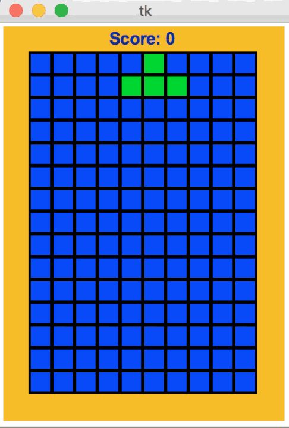

# Tetris

## Abstract
Note that this design for Tetris is somewhat simplified, though the end result is indeed a reasonably functional game of Tetris. Also, the techniques used to create this game can be used to create many other popular arcade games.

## Content
* Prerequisites (Python, Tkinter, and Event-Based Animations)
* Building Tetris
* Design Overview
* Creating and Drawing the board
* Creating and Drawing the fallingPiece
* Moving the fallingPiece left/right/down
* Rotating the fallingPiece
* Dropping and Placing the fallingPiece and Handling Game-Over
* Removing Full Rows and Keeping Score
* More Ideas

For further details, please visit.
### [step-by-step tutorial](https://github.com/yuanpenc/Yuanpeng.github.io/blob/master/progress%20report/progress%20report%201(9.28).md)

## Game Overview

<p align="center">
  
</p>
<p align="center">
  (http://www.kosbie.net/cmu/fall-19/15-112/notes/notes-tetris/2_7_RemovingFullRows.html)
</p>

## Let's Do It
Note: Before you refer and run this code, download these packages to make sure this program runing successfully.
* cmu_112_graphics.py
* cs112_f19_week7_linter.py


```
#################################################
# Tetris!
#
# name: Yuanpeng Cao
# andrew id: yuanpenc
#
# partner's name:Kezhen Zhao
# partner's andrew id: kezhenz
#################################################

import cs112_f19_week7_linter
import math, copy, random

from cmu_112_graphics import *
from tkinter import *
import time

#################################################
# Helper functions
#################################################

def almostEqual(d1, d2, epsilon=10**-7):
    # note: use math.isclose() outside 15-112 with Python version 3.5 or later
    return (abs(d2 - d1) < epsilon)

import decimal
def roundHalfUp(d):
    # Round to nearest with ties going away from zero.
    rounding = decimal.ROUND_HALF_UP
    # See other rounding options here:
    # https://docs.python.org/3/library/decimal.html#rounding-modes
    return int(decimal.Decimal(d).to_integral_value(rounding=rounding))

#################################################
# Functions for you to write
#################################################

###test function
def maxItemLength(a):
    maxLen = 0
    rows = len(a)
    cols = len(a[0])
    for row in range(rows):
        for col in range(cols):
            maxLen = max(maxLen, len(str(a[row][col])))
    return maxLen

def print2dList(a):
    if (a == []):
        # So we don't crash accessing a[0]
        print([])
        return
    rows = len(a)
    cols = len(a[0])
    fieldWidth = maxItemLength(a)
    print("[ ", end="")
    for row in range(rows):
        if (row > 0): print("\n  ", end="")
        print("[ ", end="")
        for col in range(cols):
            if (col > 0): print(", ", end="")
            # The next 2 lines print a[row][col] with the given fieldWidth
            formatSpec = "%" + str(fieldWidth) + "s"
            print(formatSpec % str(a[row][col]), end="")
        print(" ]", end="")
    print("]")
####test function

def gameDimensions():
        rows=15
        cols=10
        cellSize=50
        margin=50
        return (rows,cols,cellSize,margin)

def appStarted(app):
        (app.rows,app.cols,app.cellSize,app.margin)=gameDimensions()
        app.width=app.cols*app.cellSize+2*app.margin
        app.height=app.rows*app.cellSize+2*app.margin
        app.waitingForFirstKeyPress=True
        app.score=0
        app.timerDelay = 300
        initBoard(app)
        

def initBoard(app):
    emptyColor='blue'
    app.board=[[emptyColor]*app.cols for row in range (app.rows)]
    app.gameover=False
    newFallingPiece(app)

def newFallingPiece(app):
    
    iPiece = [
        [  True,  True,  True,  True ]
    ]

    jPiece = [
        [  True, False, False ],
        [  True,  True,  True ]
    ]

    lPiece = [
        [ False, False,  True ],
        [  True,  True,  True ]
    ]

    oPiece = [
        [  True,  True ],
        [  True,  True ]
    ]

    sPiece = [
        [ False,  True,  True ],
        [  True,  True, False ]
    ]

    tPiece = [
        [ False,  True, False ],
        [  True,  True,  True ]
    ]

    zPiece = [
        [  True,  True, False ],
        [ False,  True,  True ]
    ]

    app.tetrisPieces = [ iPiece, jPiece, lPiece,\
                          oPiece, sPiece, tPiece, zPiece ]
    app.tetrisPieceColors = [ "red", "yellow", "magenta", "pink", \
                          "cyan", "green", "orange" ]
    randomIndex = random.randint(0, len(app.tetrisPieces) - 1)
    app.fallingPiece=app.tetrisPieces[randomIndex]
    app.fallingPieceColor=app.tetrisPieceColors[randomIndex]
    app.initCol=app.cols//2-len(app.fallingPiece[0])//2
    app.initRow=0


def newCheatingPiece(app):
     cheatingPiece = [
        [  True,  True,  True,  True, True ],
        [  True,  True,  True,  True, True ]
    ]
     app.fallingPiece=cheatingPiece
     app.fallingPieceColor='cyan'
     app.initCol=app.cols//2-len(app.fallingPiece[0])//2
     app.initRow=0
    
def keyPressed(app, event):
    if (app.waitingForFirstKeyPress):
        app.waitingForFirstKeyPress = False
    elif (event.key == 'r'): initBoard(app)
    elif app.gameover: return 
    elif event.key=='Down': moveFallingPiece(app,+1,0)
    elif event.key=='Up': rotateFallingPiece(app)
    elif (event.key == 'Left'):  moveFallingPiece (app,0, -1)
    elif (event.key == 'Right'): moveFallingPiece (app,0, +1)
    elif (event.key == 'r'): initBoard(app)
    elif event.key=='Space': hardDrop(app)
    # cheating press : you change directly change a fallingpiece.
    elif event.key=='n':
         newFallingPiece(app)
    elif event.key=='c':  
         newCheatingPiece(app)
    
def hardDrop(app):
    while fallingPieceIsLegal(app):
          app.initRow+=1
    if   not fallingPieceIsLegal(app):
         app.initRow-=1

def moveFallingPiece(app,drow,dcol):
    tempRow,tempCol=app.initRow,app.initCol
    app.initRow+=drow
    app.initCol+=dcol
    if not fallingPieceIsLegal(app):
        app.initRow=tempRow
        app.initCol=tempCol
        return False
    return True

def fallingPieceIsLegal(app):
    for row in range (len(app.fallingPiece)):
        for col in range (len(app.fallingPiece[0])):
            if  app.fallingPiece[row][col]==True:
                if (app.initRow+row>=app.rows or app.initCol+col>=app.cols or\
                    app.initRow<0 or app.initCol<0 or\
                    app.board[app.initRow+row][app.initCol+col]!='blue'):
                    return False
    return True

def rotateFallingPiece(app):
    tempList=app.fallingPiece
    tempRow=app.initRow
    tempCol=app.initCol
    newrows=len(app.fallingPiece[0])
    newcols=len(app.fallingPiece)
    new2dList=[[None]*newcols for row in range (newrows)]
    for row in range (len(app.fallingPiece)):
        for col in range (len(app.fallingPiece[0])):
            newrow=len(app.fallingPiece[0])-1-col
            newcol=row
            new2dList[newrow][newcol]=app.fallingPiece[row][col]
    #print2dList(new2dList)
    app.fallingPiece =new2dList 
    app.initRow=app.initRow+newcols//2-newrows//2
    app.initCol=app.initCol+newrows//2-newcols//2
    if not fallingPieceIsLegal(app):
        app.fallingPiece=tempList
        app.initRow=tempRow
        app.initCol=tempCol


def timerFired(app):
    if app.gameover or app.waitingForFirstKeyPress: return
    result=moveFallingPiece(app,+1,0)
    if not result:
       placeFallingPiece(app)
       newFallingPiece(app)
    if not fallingPieceIsLegal(app):
        app.gameover=True


def placeFallingPiece(app):
    for row in range(len(app.fallingPiece)):
        for col in range (len(app.fallingPiece[0])):
            if app.fallingPiece[row][col]==True:
                app.board[app.initRow+row][app.initCol+col]=\
                app.fallingPieceColor
    removeFullRows(app)

def removeFullRows(app):
    score=0
    newboard=[]
    index=0
    #remove full row
    while index<len(app.board):
        blueCount=0
        for item in app.board[index]:
            if item=='blue':
                blueCount+=1
        if blueCount==0:
            app.board.pop(index)
            score+=1
        else: 
            index+=1
    # assign removedboard to newboard and fill up the missing rows
    rowcount=len(app.board)
    for row in app.board:
        newboard.append(row)
    for addrow in range (app.rows-rowcount):
        newboard.insert(0,['blue']*app.cols)
    app.board=newboard
    app.score+=score

def drawScore(app,canvas):
    canvas.create_text(app.width/2, app.margin/2,
                           text='Scores:%d'%app.score,
                           font='Arial 17 bold')

def drawBoard(app,canvas):
    canvas.create_rectangle(0,0,app.width,app.height,fill='yellow')
    for row in range(app.rows):
        for  col in range (app.cols):
             drawCell(app,canvas,row,col,app.board[row][col])

def drawCell(app,canvas,row,col,color):
    gridWidth=app.width-2*app.margin
    gridHeight=app.height-2*app.margin
    x0 = app.margin + gridWidth * col / app.cols
    x1 = app.margin + gridWidth * (col+1) / app.cols
    y0 = app.margin + gridHeight * row / app.rows
    y1 = app.margin + gridHeight * (row+1) / app.rows
    canvas.create_rectangle(x0,y0,x1,y1,fill=color,width=4)


def drawFallingPiece(app,canvas):
    #newFallingPiece(app)
    for row in range(len(app.fallingPiece)):
        for col in range (len(app.fallingPiece[0])):
             if app.fallingPiece[row][col]==True:
                drawCell(app,canvas,row+app.initRow,
                col+app.initCol,app.fallingPieceColor)

def drawGameOver(app, canvas):
    canvas.create_text(app.width/2, app.height/2, text='Game over!',
                           font='Arial 26 bold',fill='red')
    canvas.create_text(app.width/2, app.height/2+40,
                        text='Press r to restart!',
                        font='Arial 22 bold',fill='red')

def redrawAll(app,canvas):
    if (app.waitingForFirstKeyPress):
        canvas.create_text(app.width/2, app.height/2,
                           text='Press any key to start!',
                           font='Arial 24 bold')
    else:
        drawBoard(app,canvas)
        drawFallingPiece(app,canvas)
        drawScore(app,canvas)
        if app.gameover:drawGameOver(app, canvas)
    
        
def playTetris():
    (rows,cols,cellSize,margin)=gameDimensions()
    width=cols*cellSize+2*margin
    height=rows*cellSize+2*margin
    runApp(width=width,height=height)

#################################################
# main
#################################################

def main():
    cs112_f19_week7_linter.lint()
    playTetris()

if __name__ == '__main__':
    main()


```

Good Luck!!!
